# rustegex

A hobby regular expression engine in Rust.

- Supports 3 types of engines:
    - DFA-based engine
        - Converts regex to NFA, then NFA to DFA via subset construction
        - Matching is a single linear scan over the input with no backtracking
        - Character classes are expanded into the ASCII transition table at compile time
    - VM-based engine
        - Pike VM (Thompson NFA lockstep simulation)
        - Processes all active NFA states simultaneously per input character
    - Derivative-based engine
        - Matches by repeatedly computing Brzozowski's derivative of the pattern
- Matching:
    - `is_match`: the entire input must match
    - `is_partial_match`: any substring may match
- Supported syntax:
    - Quantifiers: `*`, `+`, `?`
    - Alternation and grouping: `|`, `()`
    - Escapes: `\` (for example `\*`, `\|`, `\.`)
    - Metacharacters:
        - `.` — any character except newline
        - `\d` — ASCII digit `[0-9]`
        - `\w` — ASCII word character `[a-zA-Z0-9_]`
        - `\s` — ASCII whitespace
    - Unicode literal characters in patterns and inputs

## Example

DFA-based:

```rust
let regex = rustegex::Engine::new("a|b*", "dfa").unwrap();
assert!(regex.is_match("a"));
assert!(regex.is_match("b"));
assert!(regex.is_match("bb"));
assert!(regex.is_match("bbb"));
assert!(!regex.is_match("c"));

let regex = rustegex::Engine::new("ab(cd|)", "dfa").unwrap();
assert!(regex.is_match("abcd"));
assert!(regex.is_match("ab"));
assert!(!regex.is_match("abc"));
assert!(regex.is_match("abcd"));

let regex = rustegex::Engine::new("a+b", "dfa").unwrap();
assert!(regex.is_match("ab"));
assert!(regex.is_match("aab"));
assert!(regex.is_match("aaab"));
assert!(!regex.is_match("a"));

let regex = rustegex::Engine::new(r"a\|b\*", "dfa").unwrap();
assert!(regex.is_match("a|b*"));
assert!(!regex.is_match("ab"));

let regex = rustegex::Engine::new(r"a\db", "dfa").unwrap();
assert!(regex.is_match("a0b"));
assert!(regex.is_match("a9b"));
assert!(!regex.is_match("axb"));

let regex = rustegex::Engine::new("a.b", "dfa").unwrap();
assert!(regex.is_match("a b"));
assert!(regex.is_match("axb"));
assert!(!regex.is_match("ab"));
assert!(!regex.is_match("a\nb"));

let regex = rustegex::Engine::new("正規表現(太郎|次郎)", "dfa").unwrap();
assert!(regex.is_match("正規表現太郎"));
assert!(regex.is_match("正規表現次郎"));
assert!(!regex.is_match("正規表現三郎"));
```

VM-based:

```rust
let regex = rustegex::Engine::new("a|b*", "vm").unwrap();
assert!(regex.is_match("a"));
assert!(regex.is_match("b"));
assert!(regex.is_match("bb"));
assert!(regex.is_match("bbb"));
assert!(!regex.is_match("c"));

let regex = rustegex::Engine::new("ab(cd|)", "vm").unwrap();
assert!(regex.is_match("abcd"));
assert!(regex.is_match("ab"));
assert!(!regex.is_match("abc"));
assert!(regex.is_match("abcd"));

let regex = rustegex::Engine::new("a+b", "vm").unwrap();
assert!(regex.is_match("ab"));
assert!(regex.is_match("aab"));
assert!(regex.is_match("aaab"));
assert!(!regex.is_match("a"));

let regex = rustegex::Engine::new(r"a\|b\*", "vm").unwrap();
assert!(regex.is_match("a|b*"));
assert!(!regex.is_match("ab"));

let regex = rustegex::Engine::new(r"\w+", "vm").unwrap();
assert!(regex.is_match("foo_bar"));
assert!(!regex.is_match("-"));

let regex = rustegex::Engine::new("正規表現(太郎|次郎)", "vm").unwrap();
assert!(regex.is_match("正規表現太郎"));
assert!(regex.is_match("正規表現次郎"));
assert!(!regex.is_match("正規表現三郎"));
```

Derivative-based:

```rust
let regex = rustegex::Engine::new("a|b*", "derivative").unwrap();
assert!(regex.is_match("a"));
assert!(regex.is_match("b"));
assert!(regex.is_match("bb"));
assert!(regex.is_match("bbb"));
assert!(!regex.is_match("c"));

let regex = rustegex::Engine::new("ab(cd|)", "derivative").unwrap();
assert!(regex.is_match("abcd"));
assert!(regex.is_match("ab"));
assert!(!regex.is_match("abc"));
assert!(regex.is_match("abcd"));

let regex = rustegex::Engine::new("a+b", "derivative").unwrap();
assert!(regex.is_match("ab"));
assert!(regex.is_match("aab"));
assert!(regex.is_match("aaab"));
assert!(!regex.is_match("a"));

let regex = rustegex::Engine::new(r"a\|b\*", "derivative").unwrap();
assert!(regex.is_match("a|b*"));
assert!(!regex.is_match("ab"));

let regex = rustegex::Engine::new(r"\s+", "derivative").unwrap();
assert!(regex.is_match(" \t"));
assert!(!regex.is_match("a"));

let regex = rustegex::Engine::new("正規表現(太郎|次郎)", "derivative").unwrap();
assert!(regex.is_match("正規表現太郎"));
assert!(regex.is_match("正規表現次郎"));
assert!(!regex.is_match("正規表現三郎"));
```

Partial search (any engine):

```rust
let regex = rustegex::Engine::new("(p(erl|ython|hp)|ruby)", "dfa").unwrap();
assert!(regex.is_match("python"));
assert!(!regex.is_match("I write python"));
assert!(regex.is_partial_match("I write python"));
assert!(!regex.is_partial_match("I write rust"));
```

## Test

```bash
$ cargo test
```

## Run Benchmarks

```bash
$ cargo bench --bench benchmark
```

<!-- bench-graphs:begin -->

## Benchmarks

Comparison against the [`regex`](https://crates.io/crates/regex) crate. All benchmarks were conducted on Ubuntu 26.04 running an Intel Core Ultra 5 325. For the Derivative engine results, which were primarily collected for experimental purposes, please view them as reference values.

### Full-string `is_match`

rustegex `is_match` requires the entire input to match. `regex::Regex::is_match` is an unanchored search, so these numbers are not always the same problem.

#### case 1

Pattern `(p(erl|ython|hp)|ruby)`

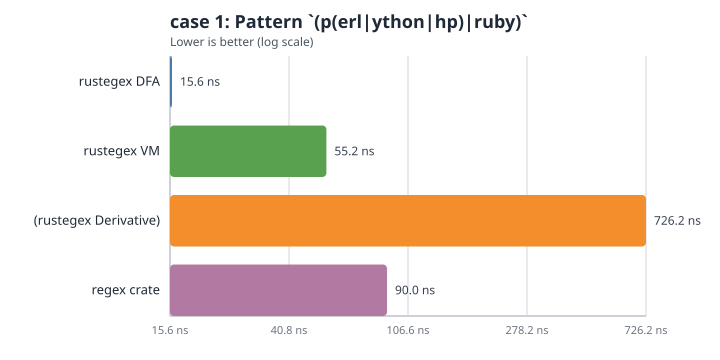

#### case 2

Pattern `ab(cd|)ef|g*|h+`

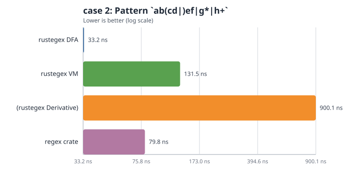

#### case long

Pattern `a+b`, input is 1,000,000 `a` characters

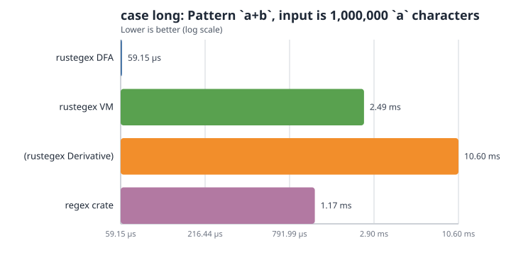

#### case meta

Pattern `a\db|\s\w+|.\d`

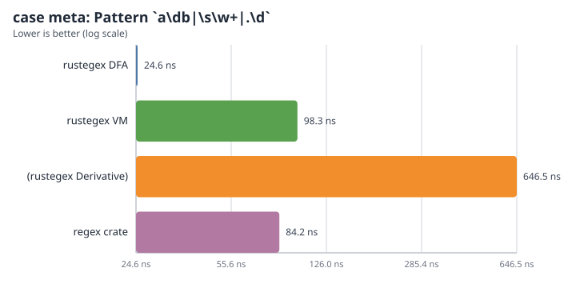

#### case meta long

Pattern `\d+`, input is 1,000,000 ASCII digits

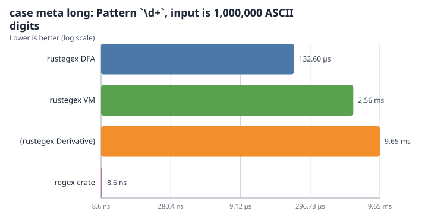

### Partial search

rustegex `is_partial_match` versus `regex::Regex::is_match` (both unanchored).

#### partial literal

Pattern `Sherlock` in a ~600 KB haystack

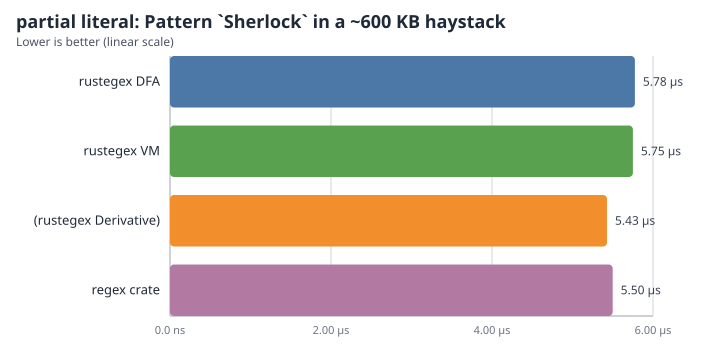

#### partial alt

Pattern `(p(erl|ython|hp)|ruby)` in a 240 KB haystack

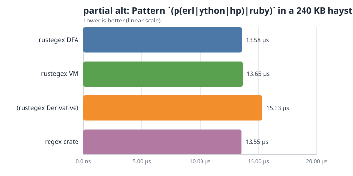

#### partial long

Pattern `a+b`, input is 1,000,000 `a` characters (no match)

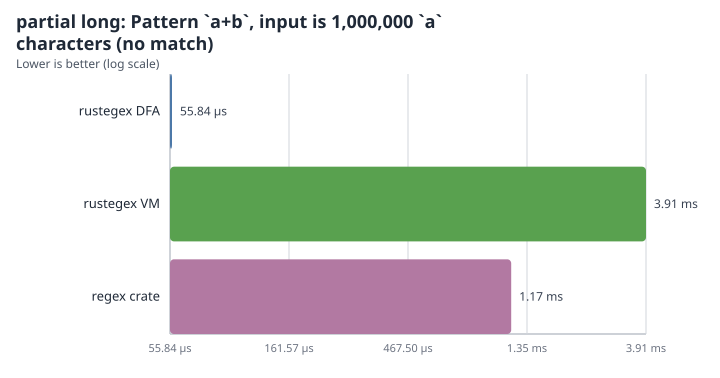

#### partial required miss

Pattern `a*bcd` in a ~200 KB haystack with no `bcd` (required-literal reject)

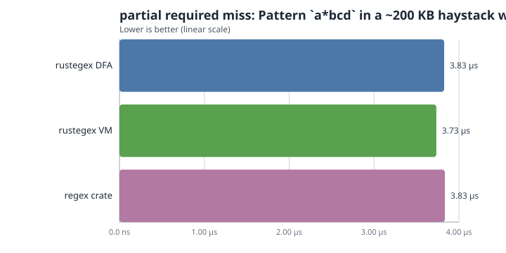

#### partial required hit

Pattern `a*bcd` with match near end of a ~200 KB haystack

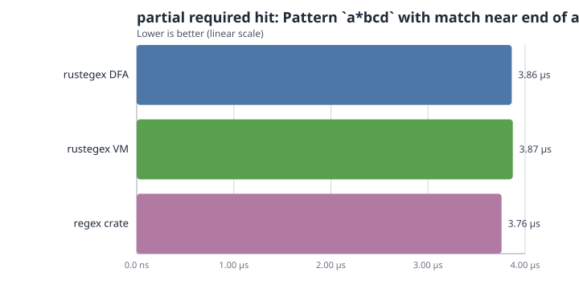

#### partial start-byte miss

Pattern `a+b` in 500 KB of `x` (first-byte prefilter miss)

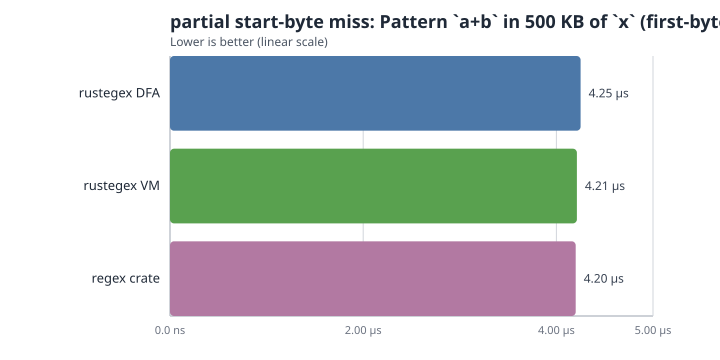

#### partial start-byte hit

Pattern `a+b` after 500 KB of `x`, match at end

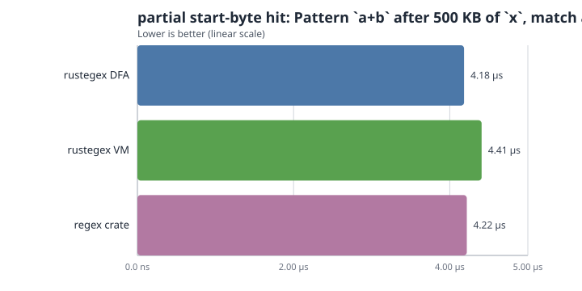

#### partial short alt

Pattern `ab|cd` in a 240 KB haystack (2-byte prefix prefilter)

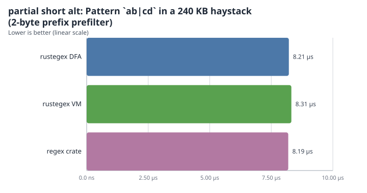

#### partial digit

Pattern `\d+` with digits near end of a large non-digit haystack

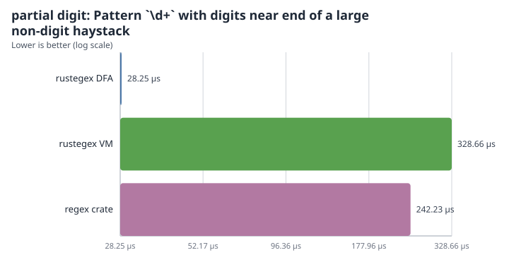

#### partial prefix fp

Pattern `abc+d` with many false `abc` prefixes before a real match

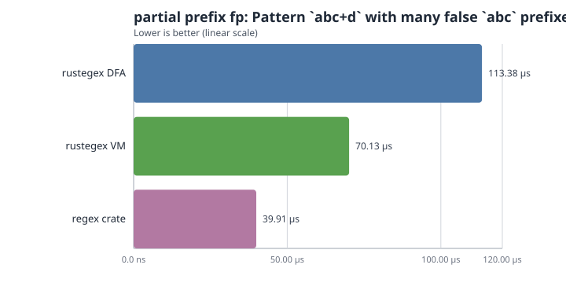

<!-- bench-graphs:end -->

## License

MIT
